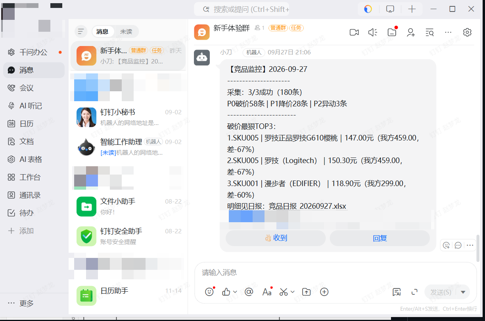
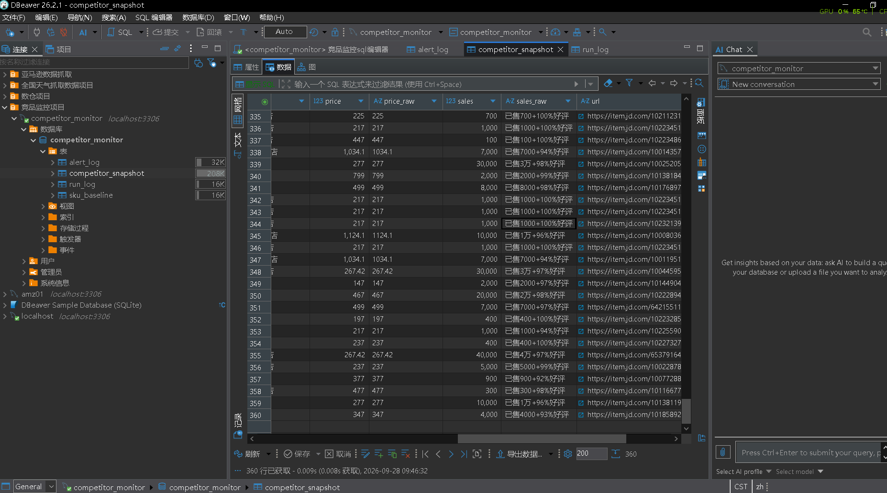
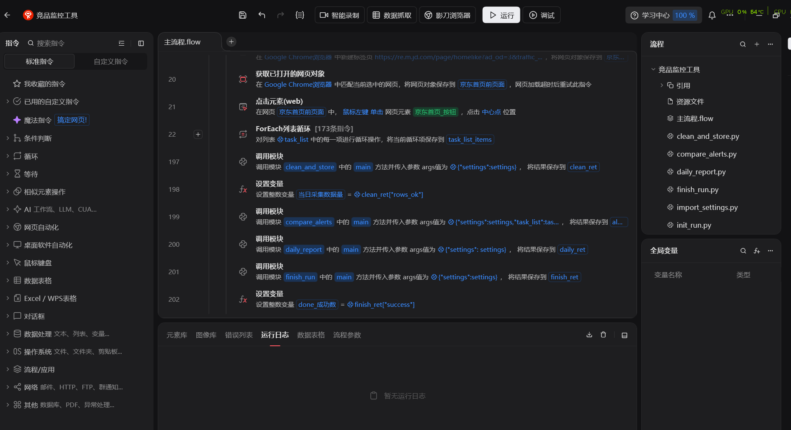
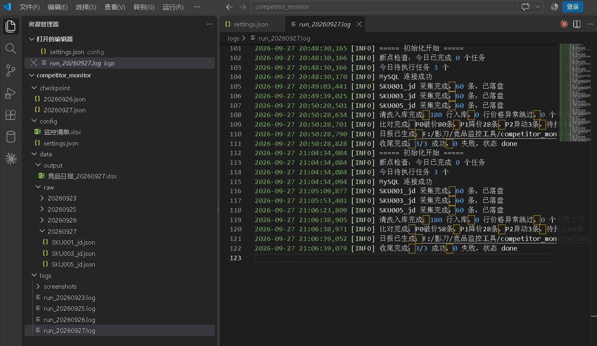

# 竞品监控工具（影刀 RPA + Python + MySQL）

> 电商竞品价格监控机器人：每天自动采集京东搜索榜单（价格/销量/店铺），与监控清单中的我方定价比对，按 P0/P1/P2 三级生成告警并推送钉钉群，全量数据入库可追溯。
>
> 架构一句话：**影刀做编排和浏览器操作，Python 模块做数据处理，JSON 文件做环节契约，MySQL 做数据底座。**

## 业务背景

电商运营每天需要人工盯竞品动态：搜关键词、翻页抄价格到 Excel、凭记忆判断有没有降价——约 2 小时/天，且无历史数据、无告警机制。本工具将其自动化：**配置（Excel）→ 采集（影刀）→ 清洗入库（Python+MySQL）→ 三级比对告警 → 钉钉推送**，全流程无人值守。

## 运行效果

- 监控 3 个 SKU（蓝牙耳机/榨汁机/机械键盘），每 SKU 采集销量榜 2 页共 60 个竞品
- 两日连续快照入库，单日 180 行；首日产出 P0 破价告警 55 条、P2 店铺异动 4 条
- 钉钉群推送格式：运行汇总 + 分级计数 + 破价最狠 TOP3（按价差幅度排序）

```
【竞品监控】2026-09-27
----------------------
采集：3/3成功（180条）
P0破价80条｜P1降价28条｜P2异动3条
----------------------
破价最狠TOP3：
1.SKU003｜xxx｜6.86元（我方129.00，差-94%）
2.SKU001｜漫步者（EDIFIER）｜74.71元（我方299.00，差-75%）
...
明细见日报：竞品日报_20260927.xlsx
```

（此处截图：钉钉推送 / 数据库快照表 / 影刀主流程 / 目录结构）









## 系统架构

```
config/监控清单.xlsx + settings.json（运营可自助维护，零代码改动）
        │
        ▼
┌──────────────── 影刀主流程（编排层）────────────────┐
│  import_settings → init_run（目录/日志/断点/连库）   │
│        │                                            │
│        ▼ 循环 task_list（断点续跑，已完成自动跳过）    │
│   京东采集（销量排序+翻页+单字段兜底）                 │
│        │                                            │
│        ▼                                            │
│   save_raw_and_checkpoint（原始JSON落盘→更新断点）    │
└─────────────────────────────────────────────────────┘
        │  data/raw/{日期}/{SKU}.json（原始凭证，永久留痕）
        ▼
  clean_and_store（清洗解析→先删后插→幂等入库）
        ▼
  compare_alerts（P0破价/P1环比降价/P2店铺异动 → alert_log）
        ▼
  影刀原生钉钉指令（TOP3汇总推送）→ 执行SQL回写 notified=1
```

## 功能清单（如实标注状态）

| 功能 | 状态 |
|---|---|
| 京东搜索榜单采集（销量排序、翻页、单字段异常兜底） | ✅ 已实现 |
| 配置外置（Excel 清单 + settings.json，含启停开关） | ✅ 已实现 |
| 断点续跑（checkpoint 按天记录，崩溃后只跑剩余任务） | ✅ 已实现 |
| 强制全量重跑开关（force_rerun） | ✅ 已实现 |
| 原始 JSON 按天落盘留痕 | ✅ 已实现 |
| 清洗入库（价格/销量字符串解析、店铺名换行清洗） | ✅ 已实现 |
| 幂等体系（唯一键去重 + 同SKU先删后插 + INSERT IGNORE + notified 标记） | ✅ 已实现 |
| P0 破价告警（对比我方基准价，含品牌词相关度打标） | ✅ 已实现 |
| P1 环比降价告警（同 url 跨天比价） | ✅ 已实现（含告警演练验证） |
| P2 店铺异动告警（店铺进出榜单 diff） | ✅ 已实现 |
| 钉钉群推送（影刀原生指令，加签模式，TOP3 汇总格式） | ✅ 已实现 |
| 推送幂等（notified 回写，重跑不重复打扰） | ✅ 已实现 |
| 失败任务单点跳过不炸全局（Try-Catch + 失败落盘留痕） | ✅ 已实现 |
| 日报 Excel 生成 | 🚧 进行中 |
| 运行收尾（run_log 回填 end_time/成功率/状态） | 🚧 进行中 |
| 淘宝平台采集子流程 | 📋 二期规划 |
| 登录态/风控页自动检测与熔断 | 📋 二期规划 |
| 启动时配置校验（Excel 格式检查报告） | 📋 二期规划 |
| 排除词表外置（配件/同款类误报过滤） | 📋 二期规划 |
| 价格趋势可视化 | 📋 二期规划 |

## 目录结构

```
competitor_monitor/
├── config/
│   ├── settings.json         # MySQL连接/采集参数/钉钉webhook/功能开关（不入库Git）
│   └── 监控清单.xlsx          # SKU基准价、监控关键词、破价/降价阈值、启停状态
├── data/
│   ├── raw/{日期}/           # 采集原始JSON，永久留痕，清洗环节的输入
│   └── output/               # 日报Excel
├── logs/
│   ├── run_{日期}.log        # 分级日志（INFO/WARN/ERROR）
│   └── screenshots/          # 异常截图留证
├── checkpoint/{日期}.json    # 断点文件，记录当日已完成任务
└── 影刀应用/
    ├── 主流程.flow
    └── Python模块：import_settings / init_run / save_raw_and_checkpoint
                    / clean_and_store / compare_alerts / to_json_str(调试用)
```

## 数据库设计（MySQL 8，utf8mb4）

| 表 | 角色 | 说明 |
|---|---|---|
| competitor_snapshot | 事实表（每日快照） | 竞品榜单逐条记录；唯一键 (task_date, sku_id, platform, url) 保证幂等；price/price_raw 清洗值与原始凭证双列并存 |
| alert_log | 告警事实表 | 三级告警；detail 唯一键防重复记录；notified 标记防重复推送；price/our_price/gap_pct 结构化字段支撑 TOP3 排序 |
| run_log | 运行流水 | 每天一行，running/done/partial 状态机，卡 running 即"跑过没跑完"的告警信号 |
| sku_baseline | 维度表（二期启用） | 预留：基准价入库后 compare 与采集彻底解耦 |

价格一律 `DECIMAL(10,2)`，拒绝浮点误差参与比价。

## 快速开始

1. 环境：影刀 RPA、MySQL 8.x、影刀 Python 环境安装 `pymysql`、`openpyxl`
2. 建库建表：执行 `sql/init.sql`（utf8mb4）
3. 复制 `config/settings.example.json` 为 `settings.json`，填入 MySQL 与钉钉机器人配置（**settings.json 已加入 .gitignore，绝不上传**）
4. 按表头格式维护 `config/监控清单.xlsx`（可改内容，勿动列结构）
5. 影刀打开应用，运行主流程

## 核心设计

**1. 按天分区是幂等体系的骨架**：checkpoint 按日期命名、raw 按日期分目录、snapshot/alert_log 以 task_date 入唯一键、run_log 以 task_date 为主键——跨天天然隔离，同日重跑层层去重。

**2. 双通道幂等**：`INSERT IGNORE`（有就不管）用于 alert_log 防重复记录；`ON DUPLICATE KEY UPDATE`（有就更新）用于 run_log 刷新状态。同 SKU 当日重跑先删后插，保证"以最后一次为准"。

**3. 推送幂等独立成闸**：告警产生（alert_log）与告警通知（钉钉）是两套机制，notified 标记保证"先推成功才标记，宁可重推不漏推"（at-least-once）。

**4. 原始数据不改一个字**：采集层保留 price_raw/sales_raw 原始字符串，清洗只产生派生值——出问题随时回查原始凭证，raw JSON 与数据库双层留痕。

**5. 失败要可控**：单 SKU 失败跳过不炸全局；初始化失败（MySQL 断连/配置缺失）主动终止并说明原因，不空跑；所有异常截图+日志+状态码留痕。

## 迭代记录（真实踩坑）

1. **影刀代码块作用域隔离**：内联代码块间变量不共享且输出映射不稳定 → 全部迁移为 Python 模块（参数进、return 出），模块可脱离影刀单独测试
2. **items 只剩最后一条**：JSON 组装误放在数据表格循环内，每行覆盖 → 循环内只攒零件、循环外组装一次
3. **logging.basicConfig 静默失效**：影刀 Python 进程常驻，root logger 首次配置后 basicConfig 空转 → 改用命名 logger + FileHandler
4. **同日重跑行数翻倍**：电商榜单两次返回不同 url 集合，唯一键拦不住 → 语义定为"同日以最后一次为准"，按 SKU 先删后插
5. **店铺名夹带换行符**：`"品牌超级店\nxx旗舰店"` → 清洗层取最后一行真店名，否则店铺维度统计失真
6. **配件类商品误报破价**："适用xx"的 6 元配件以 -94% 价差登顶 TOP3 → 相关度打标 v2 增加排除词表（同款/平替/适用/配件）
7. **触发平台风控**：调试期高频全量重采导致账号被限制登录 7 天 → 三条整改：调试链路与采集解耦（缓存调试模式）、请求频率降级（随机间隔拉长、收敛翻页）、风控页自动熔断（二期）

## 风险与合规声明

本项目为个人学习作品。电商平台的自动化访问受平台用户协议约束，高频或不当访问可能触发风控（本项目开发中已实际触发并复盘整改）。使用者应控制访问频率、仅采集公开页面数据、不得用于商业抓取或转售。请遵守目标平台的 robots 协议与用户协议。

## Roadmap

- **二期**：日报 Excel、run_log 收尾闭环、淘宝子流程、登录态/风控熔断、启动配置校验、排除词表外置、sku_baseline 解耦
- **三期**：价格趋势图、影刀计划任务每日调度、多平台横向比价
